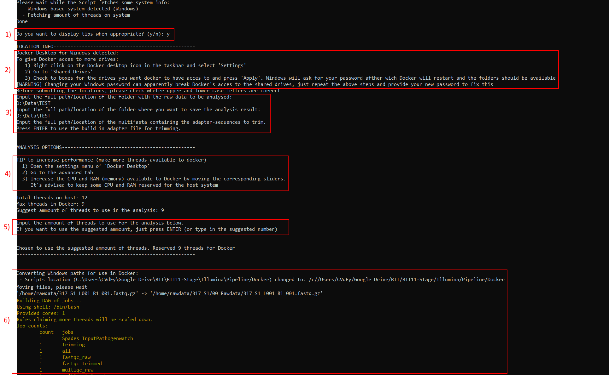

# Pipeline to create assembly's for pathogenwatch

## WARNING
**This pipeline/ code was written for my bioinformatics-insternship in the Insititute of Tropical Medicine in Antwerp (Belgium). 
Please contact them if you want to use this pipeline and get the latest version.**

## Introduction
Containerised analysis pipeline for Illumina-Short-reads using Docker containers and the Snakemake tool.
## Installation
In order to run the pipeline, the following steps need to be preformed.
### Install Docker
 - Linux: 
      1) Downloading + installation
          - CentOS: https://docs.docker.com/install/linux/docker-ce/centos/
          - Ubuntu: https://docs.docker.com/install/linux/docker-ce/ubuntu/
          - Debian: https://docs.docker.com/install/linux/docker-ce/debian/
          - Fedora: https://docs.docker.com/install/linux/docker-ce/fedora/
      2) preform the post installation steps: https://docs.docker.com/install/linux/linux-postinstall/
 - Windows:
      - All versions of Windows: https://docs.docker.com/toolbox/overview/
      - Windows 10 Pro or Enterprise:  https://hub.docker.com/editions/community/docker-ce-desktop-windows
 - MacOS: https://hub.docker.com/editions/community/docker-ce-desktop-mac
### Install Python3
 - Linux:
      1) open terminal
      2) execute: *'syntax to download packages'* pyhton3
 - Windows:
      1) download the latest version of python3 (at the moment of writhing this is pyhton 3.7.3): https://www.python.org/downloads/
      2) preform the installation, most of the default options should be fine but the option to **add python to the PATH** needs to be enabled
 - MacOS: https://www.python.org/downloads/release/python-373/
### Downloading the repository from github
1) click on releases
2) select the latest release
3) download either the ".zip" (Windows) or the ".tar.gz" (Linux/ MacOS) version
5) place the archive in the directory of choice
4) extract the files from the archive to the directory
 
## Pipeline
### Starting the pipeline
In Order to run the pipeline you need the scripts folder and the "get_environment.py" file provided in this repository. For those not familliar with a command line interface, there are 2 'auto-run scripts' provided, one for Windows users and one for Linux users:
- For Linux/ MacOS users: LINUX_run-pipeline.sh
- For Windows users: WINDOWS_run-pipeline.cmd

For those that are familiar with the command line, you can run the "get_environment.py" script with the required input given as extra command line arguments allowing you to skip the input questions. The amount of threads and the adaptor file are optional, if not provided the script will use the build in defaults.

       python3 <path to get_environment.py> <path to rawdata> <path to desired results folder> <ammount of threads> <path to adaptor file for trimming>
*for Windows: replace python3 with python.exe*

#### UNIX/ MacOS
For Linux/ MacOS users: the file permissions of the scripts might be changed after downloading. They should have executable rights in order to work. Enter "chmod 755 Linux_run-pipeline.sh" in a terminal to fix this. This guide give a non-terminal alternative for Mac-users, justkeep in mind that the file permissions should include 'execute' rights http://www.macinstruct.com/node/415.

Afterwards you might still need to specify that the file needs to be opened witht the terminal, this can be done like this:
1)	The actual place where you need to input the rawdata-location
2)	A message displaying the paths/locations to the files. You will have a slightly different message because you are using a Mac. Your message should be something similar to “Unix based system discovered, paths don’t need conversion”.
5)	This is another input field to specify the threads/ CPU to be used for the analysis. This a more advanced option, I suggest that you just press enter and go with the suggested amount of threads when this question comes up.
6)	If everything goes well you should see this orange text indicating that the analysis is starting.

You should now be able to execute the scripts by double clicking on them, after which each of them should ask for a few locations to files (see picture below). 

### The input screen
The screen in which you need to input the paths looks like this:

1)	Wheter or not you want to display tips (nr.2 and 4 in picture). This is a Window only option as are the tips.
3) The place where you need to input the rawdata and the results folder location. The adaptor file is optional, if ommited the script will use the buildin adaptor file for trimming ([adaptor-file](./Docker/04-Trimmomatic/NexteraPE-PE.fa)) These locations can easily be found by opening an explorer, navigating to the files and copying the path from there (most of the time the path will be displayed at the top of the screen). Please make sure that there are no spaces in the path to these locations.
2)	A message displaying the paths/locations to the files. This message changes a little bit depending on the OS u are using
3)	This are some Windows specific tips on how to give more recourses to docker
4)	This is another input field to specify the threads/ CPU to be used for the analysis. This a more advanced option, if you don't know what this does then you should just press enter and go withteh suggested amount of threads.
5)	If everything goes well you should see this orange text indicating that the analysis is starting.

When the analysis is complete you will get message displayed in the command line indicating this. Together with this message, the time it took to complete the analysis will be displayed.

**WINDOWS**: before activating the scripts you will need to start docker. If you use docker-toolbox doudble click on the 'Docker quickstart terminal' shortcut to start up Docker. If you use 'Docker for windows/ Docker Desktop' or are using Linux, then docker will (probably) automatically start up during system startup and you can just run the scripts.

The other files found in this repository are the codes used to create the Docker images for the containers. You don't need these since the containers will automatically be downloaded and 'installed' when the pipeline is ran for the first time (download from Docker-HUB).

### Preformed steps
The Pipline is controlled by Snakemake, which itself is being ran in a container. Snakemake will read the rules/steps specified in the Snakefile and chain them togheter in the correct order for the analysis, while monitoring in and output for each step. 

Snakemake will preform the following steps durig the analysis. Each step is specified as a rule in the Snakefile and will be executed in a docker container created for that specific task:

    0) copying files for  original location to the current-analysis folder (data/)
    1) QC on raw data using FastQC
    2) QC on raw data using MultiQC
    2) Trimmomatic
    3) QC on trimmed data using FastQC
    4) QC on trimmed data usisg MultiQC
    4) Spades
    5) File renaming
    6) Use results in Pathogenwatch.com (manual step)
  
### Results
the resulting file structure should look like this, with all rawdata and analysis data grouped per sample. To make reviewing the QC a bit easier, the MultiQC results for the full run (all samples) are stored sepparatly under QC-MultiQC/date. The full log of the snakemake program can be found under Snakemake_logs.

      data
       |--Sample1
       |     |-- 00_Rawdata
       |     |-- 01_QC-Rawdata
       |     |        |-- QC_fastqc
       |     |        |-- QC_MultiQC (multiqc of only this sample)
       |     |-- 02_Trimmomatic
       |     |        |--sample1_U.gz
       |     |        |--sample1_P.gz
       |     |-- 03_QC-Trimmomatic_Paired
       |     |        |-- QC_fastqc
       |     |        |-- QC_MultiQC (multiqc of only this sample)
       |     |-- 04_SPAdes
       |     |-- 05_inputPathogenWatch
       |--Sample2
       |--QC_MultiQC (MultiQC of all samples in the run combined)
       |     |--RUN_date
       |          |--MultiQC_rawdata
       |          |--MultiQC_trimmed
       |--Snakemake_logs
        
## Usefull commands:
  - to build containers out of the image-files (dockerfiles): 
          
          docker build --tag=<imagename>:<version> .
    
  - to run the created image:
  
          docker run -it --rm <imagename>:<version> <command>
      
  - to list all Docker images found on the host: 
  
          docker image ls
          
  - to list all container currently running on the host: 
  
          docker container ls
          
  - to remove/ stop containers that are currently running on the host: 
  
         docker container rm -f <container name>
         
  - to remove a Docker image from the host: 
  
         docker image rm <imagename>:<version>
